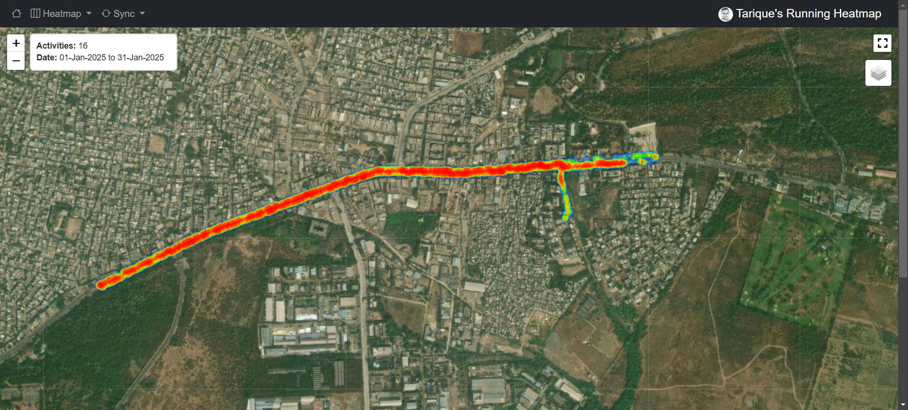

# Personal Strava Heatmap

## Summary
A lightweight web app that visualizes your running or cycling activities from Strava as an interactive heatmap, helping you track your workout routes effortlessly. Strava removed this feature for free users. 

## Features
- Displays an interactive heatmap of activities using GPS data.
- Built with Bottle and Folium for simplicity and flexibility.
- Automatically updates with data fetched from Strava's API.
- Modular structure for easy future enhancements.
- Minimal setup, accessible in browser via a local web server.
- View individual routes on the "Routes" page.

## Getting Started
### Prerequisites
- Python 3.x

### Installation
1. **Clone the repository**:
    ```sh
    git clone https://github.com/tariquesani/personal-strava-heatmap.git
    cd personal-strava-heatmap
    ```

2. **Create and activate a virtual environment** (optional but highly recommended):
    ```sh
    python -m venv .venv
    .venv\Scripts\activate  # On Windows
    source .venv/bin/activate  # On macOS/Linux
    ```

3. **Install the required packages**:
    ```sh
    pip install -r requirements.txt
    ```

4. **Set up your Strava API credentials**:
    - Create a `.env` file in the services directory with the following content:
        ```env
        CLIENT_ID=your_strava_client_id
        CLIENT_SECRET=your_strava_client_secret
        ```
    - For instructions on how to create a Strava app and get your client ID and secret, refer to the [Strava API documentation](https://developers.strava.com/docs/getting-started/#account).

### Running the Application
1. **Start the application**:
    ```sh
    python app.py
    ```

2. **Open your browser and navigate to**:
    ```
    http://localhost:8080
    ```

### Syncing Activities
- Navigate to the Sync page and follow the instructions to sync your Strava activities. 

### Viewing the Heatmap
- After syncing your activities, navigate to the Heatmap page to view your running heatmap.

### Viewing Individual Routes
- Navigate to the Routes page to view individual routes.

## Screenshot


## License
This project is licensed under the MIT License. See the [LICENSE](LICENSE) file for details.

## Disclaimer
This project is not affiliated with, endorsed by, or sponsored by Strava. All trademarks and copyrights belong to their respective owners.